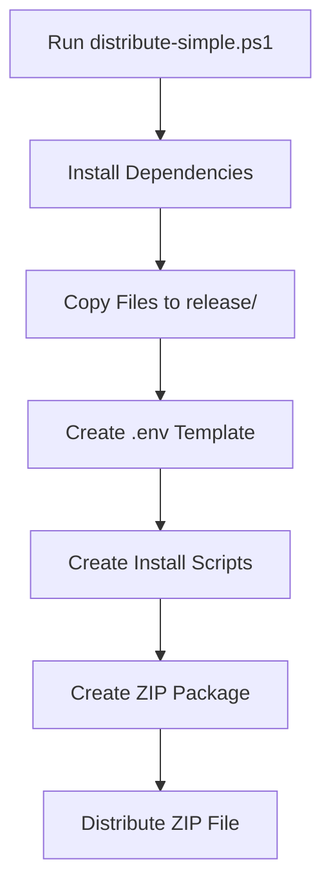
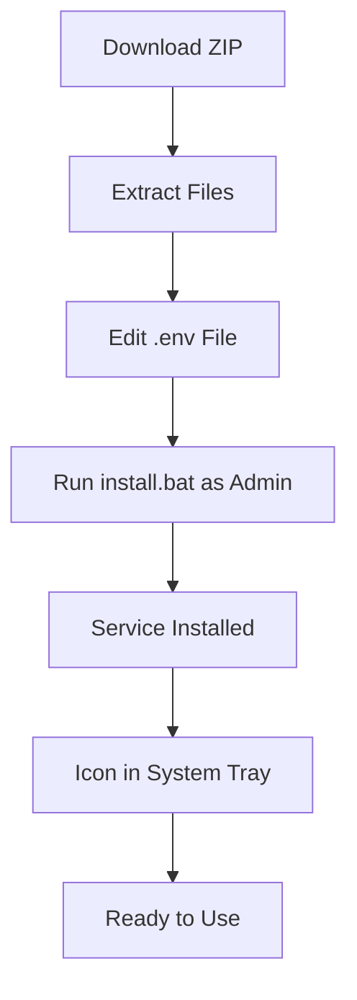

# GitFileSync Documentation

This folder contains all documentation and distribution scripts for GitFileSync.

---

## 📚 Documents

### For End Users
- **[DISTRIBUTION_GUIDE.md](./DISTRIBUTION_GUIDE.md)** - Complete installation and usage guide
- **[QUICKSTART.md](../release/QUICKSTART.md)** - Quick start guide (in release folder)
- **[README.md](../README.md)** - Project overview and features

### For Developers
- **[distribute-simple.ps1](./distribute-simple.ps1)** - Distribution script (recommended)

---

## 🚀 Quick Distribution

### Recommended Method

1. **Run distribution script:**
   ```powershell
   .\distribute-simple.ps1
   ```

2. **Share the ZIP:**
   ```
   release/GitFileSync-v1.0.0-win-x64.zip
   ```

3. **Users install by:**
   - Extracting ZIP
   - Running `install.bat` as Administrator
   - Configuring `.env` file

## 📦 Distribution Package Contents

```
release/
├── GitFileSync-v1.0.0-win-x64.zip    ← Distribute this file
├── install.bat                        ← Installation script
├── uninstall.bat                      ← Uninstallation script
├── .env                              ← User configuration
├── .env.example                      ← Configuration template
├── package.json                      ← Application metadata
├── package-lock.json                 ← Dependencies lock file
├── README.md                         ← Project documentation
├── QUICKSTART.md                     ← Quick start guide
└── src/                              ← Application source code
```

---

## 🎯 Distribution Workflow



---

## 📋 User Installation Flow



---

## 🔧 Configuration Template

Users need to configure these required settings in `.env`:

```bash
# Required: GitHub Personal Access Token
GITHUB_PAT=ghp_your_token_here

# Required: Repository URL with token
REPO_URL=https://ghp_your_token_here@github.com/username/repo.git

# Required: Local sync directory
SYNC_DIR=C:\Users\Username\GitSync
```

---

## 🛠️ Troubleshooting Quick Reference

| Issue | Solution |
|-------|----------|
| Node.js not found | Install from https://nodejs.org/ |
| Access denied | Run as Administrator |
| Icon not visible | Check notification area settings |
| Service won't start | Check logs\ directory |

---

## 📞 Support Resources

- **Installation Guide:** [DISTRIBUTION_GUIDE.md](./DISTRIBUTION_GUIDE.md)
- **Quick Start:** [QUICKSTART.md](../release/QUICKSTART.md)
- **Project README:** [README.md](../README.md)
- **GitHub Issues:** Create an issue for bugs and feature requests

---

## 📝 Version Information

- **Current Version:** 1.0.0
- **Release Date:** 2026-03-29
- **Node.js Requirement:** 18.0.0 or higher
- **Platform:** Windows 10/11

---

## 🎓 Additional Resources

- [Node.js Installation](https://nodejs.org/)
- [GitHub Personal Access Tokens](https://github.com/settings/tokens)
- [Git Documentation](https://git-scm.com/doc)
- [Windows Services Guide](https://docs.microsoft.com/en-us/dotnet/framework/windows-services/)

---

**Need help? Check the [DISTRIBUTION_GUIDE.md](./DISTRIBUTION_GUIDE.md) for detailed instructions!**
